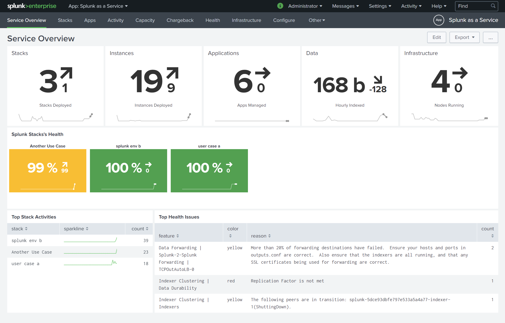
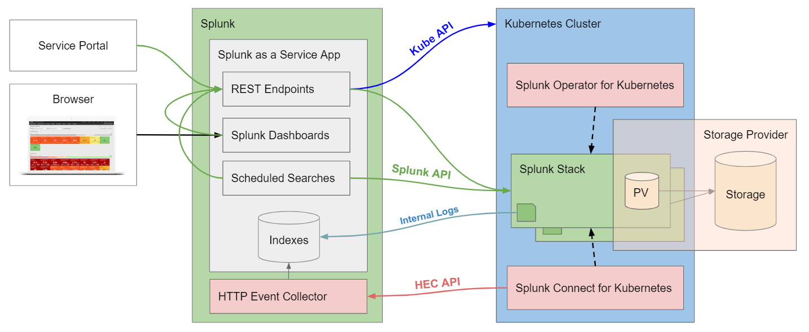

# Splunk as a Service App

A Splunk app to deploy, manage and monitor Splunk environments in remote Kubernetes clusters.

This is an early prototype and should not be used in a production environment.

## Features

- Managing Splunk environments
- Activity tracking
- Capacity monitoring
- Application management
- Changeback analytics
- Health tracking
- Performance testing
- REST API for managing resources
- RBAC capabilities for access management

## Prerequisites

- Splunk Enterprise 8.0+ (to run this app)
- One or more Kubernetes Clusters 1.12+ (being the deployment targets)
- [Splunk Operator for Kubernetes](https://github.com/splunk/splunk-operator) 0.0.6
- [Splunk Connect for Kubernetes](https://github.com/splunk/splunk-connect-for-kubernetes)

## Architecture

## Contributing

Clone and create pull requests.

## Support

This app is not supported by Splunk Support. File issues [here](https://github.com/hovu96/splunk_as_a_service_app/issues/new).

## License

Apache License 2.0.

See [LICENSE](LICENSE).